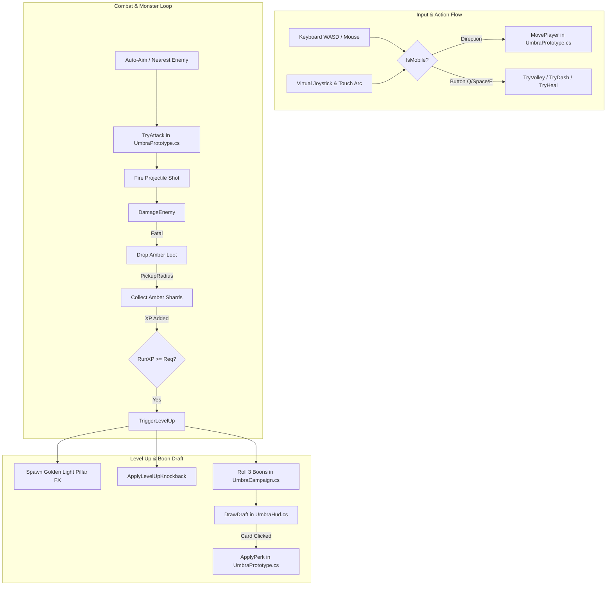

# Project Umbra — Code & Function Index (API Map)

> **For AI Agents & Developers**:  
> Read this index before performing code edits. It maps every class, data structure, property, and method across the codebase so you can jump directly to the target file and line without running expensive full-directory scans or searches.

---

## 1. High-Level File Map

| File Path | Type / Namespace | Primary Responsibility | LOC |
|---|---|---|---|
| [`CombatRules.cs`](file:///d:/ProjectUmbra/ProjectUmbra/Assets/Umbra/Runtime/CombatRules.cs) | `public static class CombatRules` (`Umbra`) | Pure balance formulas, stat calculations, perk & rune definitions. No state. | ~114 |
| [`UmbraPrototype.cs`](file:///d:/ProjectUmbra/ProjectUmbra/Assets/Umbra/Runtime/UmbraPrototype.cs) | `public partial class UmbraPrototype : MonoBehaviour` (`Umbra`) | Core loop, player movement, world gen, combat actions, amber drops, Level-Up FX, mobile touch. | ~1,144 |
| [`UmbraCampaign.cs`](file:///d:/ProjectUmbra/ProjectUmbra/Assets/Umbra/Runtime/UmbraCampaign.cs) | `public partial class UmbraPrototype` (`Umbra`) | Run lifecycle, draft generation, guardian bosses, hazards, procedural tone audio, settlement. | ~384 |
| [`UmbraHud.cs`](file:///d:/ProjectUmbra/ProjectUmbra/Assets/Umbra/Runtime/UmbraHud.cs) | `public sealed partial class UmbraHud : MonoBehaviour` (`Umbra`) | In-game IMGUI HUD, virtual analog joystick, touch action buttons, boon draft cards, stats/runes. | ~492 |
| [`UmbraCampHud.cs`](file:///d:/ProjectUmbra/ProjectUmbra/Assets/Umbra/Runtime/UmbraCampHud.cs) | `public sealed partial class UmbraHud` (`Umbra`) | Camp screen UI, stat allocations, map/class selection, expedition results screen. | ~78 |
| [`UmbraCampaignTests.cs`](file:///d:/ProjectUmbra/ProjectUmbra/Assets/Umbra/Runtime/UmbraCampaignTests.cs) | `public partial class UmbraPrototype` (`Umbra`) | 141+ automated smoke tests verifying formulas, transitions, mobile controls, and combat rules. | ~115 |
| [`UmbraProjectSetup.cs`](file:///d:/ProjectUmbra/ProjectUmbra/Assets/Umbra/Editor/UmbraProjectSetup.cs) | `public static class UmbraProjectSetup` (`Umbra.Editor`) | Unity Editor automation, command watcher (`.umbra-command`), URP setup, WebGL builds. | ~234 |

---

## 2. Detailed File & Function Index

### 📄 `CombatRules.cs`
**Namespace**: `Umbra` | **Class**: `CombatRules` (Static Utility & Data)

#### Types & Enums
- `enum RuneKind { Pierce, Scatter, Ember }`
- `enum StatKind { STR, AGI, VIT, INT, DEX, LUK }`
- `enum PerkKind { RunePierce, RuneScatter, RuneEmber, RapidFire, SwiftBoots, Multishot, Vitality, Magnetism, WindNovaPulse, Chain, Ignite, SproutCard, MushroomCard, BattleFocus }`
- `sealed class Perk { PerkKind Kind; string Title; string Category; string Description; string Rarity; }`

#### Constants
- `AttackCooldown` (0.36s), `VolleyCooldown` (7s), `DashCooldown` (1.8s), `HealCooldown` (22s)
- `MaxHealth` (120), `StatPointsPerLevel` (3), `CritMultiplier` (1.75x)
- `BossTime` (840s / 14:00), `RunDuration` (900s / 15:00)

#### Methods & Formulas
- `DamageMultiplier(int str, int dex) -> float`: Calculates total damage multiplier based on STR (+2%/pt) and DEX (+1.5%/pt).
- `AttackSpeedBonus(int agi) -> float`: Bonus attack speed (+1.5%/pt).
- `MoveSpeedBonus(int agi) -> float`: Bonus move speed (+0.4%/pt).
- `BonusHealthFromVit(int vit) -> int`: Extra max HP (+8 HP/pt).
- `HealthRegenPerSecond(int vit) -> float`: Natural health regeneration (+0.08 HP/s/pt).
- `CooldownReduction(int intel) -> float`: Cooldown reduction capped at 50% (+1.2%/pt).
- `ProjectileSpeedBonus(int dex) -> float`: Projectile flight speed bonus (+2%/pt).
- `CritChance(int luk) -> float`: Critical strike chance starting at 5%, +0.5%/pt, capped at 65%.
- `Damage(RuneKind rune, int level, int str, int dex) -> int`: Base damage calculation per projectile.
- `ProjectileCount(RuneKind rune) -> int`: 3 for Scatter, 1 for Pierce/Ember.
- `ExperienceToLevel(int level) -> int`: EXP needed for permanent Base Level progression (`60 + (level - 1) * 35`).
- `RunExperienceToLevel(int level) -> int`: EXP needed for mid-run level-up draft (`45 + (level - 1) * 25`).
- `RuneName(RuneKind rune) -> string` / `RuneDescription(RuneKind rune) -> string`: Localized display texts.
- `RollPerks(int count = 3, int luk = 1) -> List<Perk>`: Randomly rolls unweighted draft boons from `AllPerks`.

---

### 📄 `UmbraPrototype.cs` (Core Partial)
**Namespace**: `Umbra` | **Class**: `public partial class UmbraPrototype : MonoBehaviour`

#### Inner Classes
- `sealed class Enemy`: Represents an active monster (`root`, `hp`, `maxHp`, `elite`, `boss`, `burnUntil`, etc.).
- `sealed class Shot`: Active player projectile (`velocity`, `damage`, `rune`, `isCrit`, `hit` set).
- `sealed class Loot`: Amber shards dropped on ground (`root`, `shards`, `exp`).
- `sealed class FloatText`: Floating damage numbers and notifications (`point`, `text`, `color`, `until`).
- `sealed class Ring`: Telegraph and pulse ring visuals (`line`, `center`, `radius`, `lifetime`).

#### Key Properties
- `BaseLevel`, `BaseExperience`, `StatPoints`: Permanent character progression.
- `STR`, `AGI`, `VIT`, `INT`, `DEX`, `LUK`: Allocated primary attribute stats.
- `Health`, `MaxHealth`: Player health values.
- `AutoAim`: Toggle for automatic closest-target aiming vs manual mouse aim.
- `IsMobile`: Whether the game is running in mobile touch mode (auto-detected or toggled).
- `MobileMoveInput`: Analog direction vector `(-1..1, -1..1)` from the virtual joystick.
- `IsJoystickActive`, `JoystickOrigin`, `JoystickCurrent`: Virtual analog stick positions.
- `Enemies`: Read-only list of all active monsters in the scene.

#### Methods & Lifecycle
- `Start()`: Initializes camera, URP settings, player prefabs, and loads profile.
- `Update()`: Main per-frame update. Handles movement, mobile input, auto-aim firing, combat cooldowns, and loot timers.
- `LateUpdate()`: Camera follow and audio listener alignment.
- `UpdateMobileInput()`: Handles multi-touch (`Touchscreen.current.touches`), drag fallback, analog clamping (75px), and touch action triggers.
- `ToggleMobileInput()`: Switches between Desktop and Mobile Touch input modes.
- `PointerOverHud() -> bool`: Returns true if mouse/finger is touching any HUD element (prevents unintended tap-to-walk).
- `MovePlayer(Vector3 delta)`: Moves player transform while obeying `IsWalkable` boundaries.
- `IsWalkable(Vector3 p) -> bool`: Checks arena bounds, river barriers, and obstacle trees.
- `TryAttack(Vector3 point) -> bool`: Fires primary weapon (or slashes for Swordsman) towards target point.
- `Fire(Vector3 direction, RuneKind rune, int damage, bool isCrit)`: Spawns and configures projectile `Shot`.
- `TryVolley() -> bool`: Triggers Q ability (Wind Nova radial burst).
- `TryDash() -> bool`: Triggers Space ability (Dash with brief invulnerability).
- `TryHeal() -> bool`: Triggers E ability (Mend HP recovery).
- `FindNearestEnemy(Vector3 origin, float maxDistance) -> Enemy`: Targets closest live monster for auto-aim.
- `DamageEnemy(Enemy e, int damage, bool isCrit)`: Deals damage to monster, handles burns/chains, and spawns floating combat text.
- `TriggerLevelUp()`: Handles mid-run level ding, awards 1 permanent stat point, rolls boons, and launches the pillar FX.
- `SpawnLevelUpVfx()`: Spawns the golden RO-style ascending light pillar and light beacon above the player.
- `AnimateLevelUpPillar(...)`: Coroutine animating pillar ascent, alpha fade, and ease-out scaling.
- `ApplyLevelUpKnockback()`: Pushes back nearby monsters when leveling up to prevent cheap player deaths.
- `ApplyPerk(Perk perk)`: Applies selected boon card to the run state.
- `HurtPlayer(int damage)`: Reduces player HP, handles invulnerability frames, and triggers defeat if HP <= 0.
- `UpdateLoot(float dt)`: Pulls amber shards towards player within `PickupRadius` and awards amber & EXP.
- `LoadProfile()` / `SaveProfile()`: Persists permanent stats, level, amber, and settings to `PlayerPrefs`.

---

### 📄 `UmbraCampaign.cs` (Campaign Partial)
**Namespace**: `Umbra` | **Class**: `public partial class UmbraPrototype`

#### Enums & State
- `enum RunPhase { Camp, Running, Results }`
- `enum HeroClass { Novice, Archer, Mage, Swordsman }`
- `Phase`: Current game state (`Camp`, `Running`, `Results`).
- `Class`: Selected hero class.
- `RunLevel`, `RunExperience`, `RunShards`: Current expedition progress.
- `SelectedMap`, `ClearedMaps`: Unlocked campaign maps.
- `Drafting`, `ActiveDraft`: Current 3-card boon draft modal state.

#### Methods
- `EnterCamp()`: Resets run-only buffs and transitions game state to `RunPhase.Camp`.
- `StartRun()`: Begins a 15-minute expedition on the selected map, resets timer, spawns initial draft.
- `FinishRun(bool victory, string reason)`: Ends expedition, banks collected amber/XP into permanent profile, sets `Phase = Results`.
- `RerollDraft()`: Rerolls active draft cards if `Rerolls > 0`.
- `SelectMap(int map)` / `SelectClass(HeroClass kind)`: Switches active route or hero class in camp.
- `BuySupplies()`: Spends collected amber at camp to increase max HP rank.
- `ToggleSound()` / `ToggleFocus()` / `TogglePause()`: Player settings toggles.
- `UpdateRunDirector(float dt)`: Controls monster wave pacing, elites, and triggers the boss at 14:00 (840s).
- `SpawnBoss()` / `UpdateBoss(Enemy e, float dt)`: Spawns and manages guardian boss mechanics.
- `AddHazard(...)` / `UpdateHazards(float dt)`: Spawns ground telegraph damage areas (e.g. boss seeds, poison pools).
- `PlayCue(int cue)`: Synthesizes procedural sound effects (hit, draft, level-up chime, boss).

---

### 📄 `UmbraHud.cs` (Combat HUD Partial)
**Namespace**: `Umbra` | **Class**: `public sealed partial class UmbraHud : MonoBehaviour`

#### Drawing Helpers & Primitives
- `Styles()`: Initializes GUIStyles with scaled fonts.
- `Box(Rect r, Color c)`: Solid colored box.
- `Panel(Rect r)`: Framed modal dark container with gold border.
- `Label(...)` / `Bar(...)`: Text labels and progress/health bars.
- `MakeCircleTexture(int size) -> Texture2D`: Procedural antialiased circular texture generator.
- `Circle(...)` / `CircleRing(...)`: Draws soft antialiased circles and ring borders for touch UI.

#### HUD Views & Menus
- `OnGUI()`: Main GUI dispatcher. Computes 1600x900 proportional screen matrix and routes to sub-views.
- `DrawMobileCombatHud()`: Renders floating virtual analog joystick (bottom-left) and thumb-arc action buttons (DODGE, NOVA, MEND, AIM) with cooldown sweeps.
- `Skill(...)`: Renders desktop bottom ability bar (LMB, Q, Space, E).
- `DrawDraft()`: Renders the Level-Up Boon 3-card draft screen with `EaseOutBack` entrance animation, rarity colors, and full-card click/touch detection.
- `DrawRunes()`: Renders the Rune / Build inspection panel (`[TAB]`).
- `DrawStats()`: Renders character attribute stats panel (`[C]`), allows respec in Camp.
- `DrawGuide()`: Renders the controls & help modal (`[H]`).

---

### 📄 `UmbraCampHud.cs` (Camp HUD Partial)
**Namespace**: `Umbra` | **Class**: `public sealed partial class UmbraHud`

#### Methods
- `DrawCamp()`: Full-screen Camp UI:
  - Panel 1: Wanderer info, Base Level, EXP bar, Stat allocation button, Camp supplies upgrade.
  - Panel 2: Class picker (Novice, Archer, Mage, Swordsman) with unlock states and Starting Support Rune.
  - Panel 3: Expedition map selection (Amberfall Grove, Twilight Mire, Ashfall Ridge) and "BEGIN EXPEDITION" button.
  - Bottom bar: Sound toggle, Soft focus toggle, Mobile Input switch (`INPUT: MOBILE TOUCH / DESKTOP`).
- `DrawResults()`: Expedition summary screen showing time survived, kills, banked amber, earned XP, and "RETURN TO CAMP" button.

---

### 📄 `UmbraCampaignTests.cs` (Automated Test Suite)
**Namespace**: `Umbra` | **Class**: `public partial class UmbraPrototype`

#### Methods
- `RunCampaignTests(Action<string> complete)`: Comprehensive headless test suite running 141+ runtime checks:
  - Stat respec & bounds validation.
  - Draft pausing, rerolls, and perk caps.
  - Movement, river collision, and spawn safety radius.
  - Amber collection and EXP progression (verifies no EXP on monster kill, only from amber).
  - Level-up knockback distance (>= 2.5m).
  - Guardian spawn timing and 15-minute expedition time limit.
  - Class attack execution and mobile input toggling.
- `PreviewGuardian()`: Editor debug method to preview boss mechanics without waiting 14 minutes.

---

### 📄 `UmbraProjectSetup.cs` (Editor Pipeline)
**Namespace**: `Umbra.Editor` | **Class**: `public static class UmbraProjectSetup`

#### Methods & Menu Items
- `Poll()`: Background tick polling `.umbra-command` file for remote control commands:
  - `play` / `stop`: Toggle Play Mode.
  - `web`: Run full WebGL build into `Builds/Web`.
  - `test`: Run `RunCampaignTests` and write results to `.umbra-test`.
  - `setup`: Re-run URP pipeline and Amberfall scene setup.
- `CreatePrototype()`: Rebuilds URP settings, shaders, graphics assets, and generates the Amberfall scene if missing.
- `BuildWeb()`: Builds WebGL package, disables compression for raw server compatibility, and copies `Tools/web_shell.html` to `Builds/Web/index.html`.

---

## 3. Core Architectural Call Flows

---

## 4. Key Rules for Modifying Code
1. **EXP from Amber Only**: Never add `RunExperience` directly in `DamageEnemy` or when a monster dies. EXP is strictly awarded inside `UpdateLoot()` when collecting amber shards.
2. **Partial Class Cohesion**: Remember that `UmbraPrototype.cs`, `UmbraCampaign.cs`, and `UmbraCampaignTests.cs` share state via the same `UmbraPrototype` instance. Do not duplicate fields across these files.
3. **Scaled IMGUI**: All HUD coordinates in `UmbraHud.cs` and `UmbraCampHud.cs` assume a virtual resolution of `1600 x 900`. `GUI.matrix` handles scaling automatically.
4. **Mobile Safety**: When adding clickable HUD buttons, register their bounding boxes in `PointerOverHud()` in `UmbraPrototype.cs` so touching them does not cause the character to walk.
