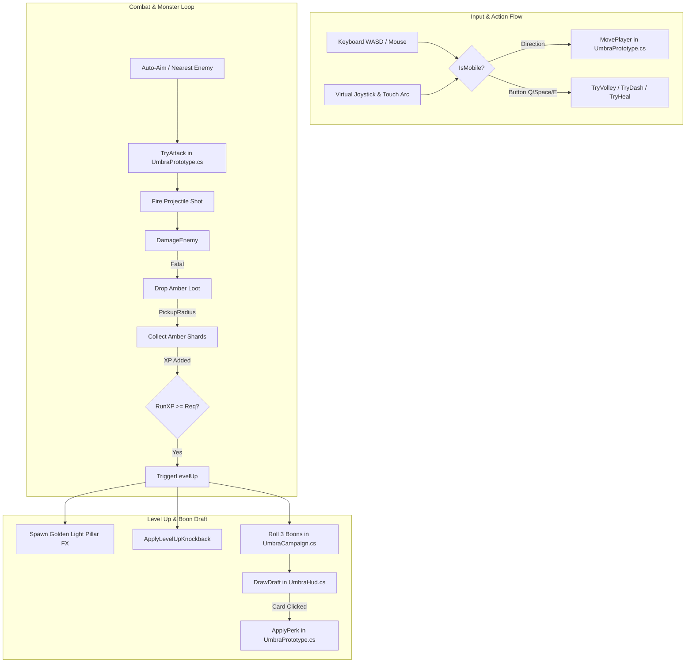

# Project Umbra — Code & Function Index (API Map)

> **For AI Agents & Developers**:  
> Read this index before performing code edits. It maps every class, data structure, property, and method across the codebase so you can jump directly to the target file and line without running expensive full-directory scans or searches.
> Read only the relevant sections of this index and follow the quota-conscious workflow in section 5.

---

## 1. High-Level File Map

| File Path | Type / Namespace | Primary Responsibility | LOC |
|---|---|---|---|
| [`CombatRules.cs`](file:///d:/ProjectUmbra/ProjectUmbra/Assets/Umbra/Runtime/CombatRules.cs) | `public static class CombatRules` (`Umbra`) | Pure balance formulas, stat calculations, perk & rune definitions. No state. | ~145 |
| [`DamageTypes.cs`](file:///d:/ProjectUmbra/ProjectUmbra/Assets/Umbra/Runtime/DamageTypes.cs) | Structs & Enums (`Umbra`) | Immutable `DamageRequest`, `DamageResult`, `DamageSourceKind`, `DamageRejectReason`. No engine dependencies. | ~60 |
| [`DamageRules.cs`](file:///d:/ProjectUmbra/ProjectUmbra/Assets/Umbra/Runtime/DamageRules.cs) | `public static class DamageRules` (`Umbra`) | Pure incoming damage formula, contact intervals/radii, and overlap testing. | ~40 |
| [`UmbraDamage.cs`](file:///d:/ProjectUmbra/ProjectUmbra/Assets/Umbra/Runtime/UmbraDamage.cs) | `public partial class UmbraPrototype` (`Umbra`) | Unified incoming damage queue, resolution gateway, Armor/reduction, protection deadlines, `HurtPlayer` adapter. | ~168 |
| [`UmbraMonsterCombat.cs`](file:///d:/ProjectUmbra/ProjectUmbra/Assets/Umbra/Runtime/UmbraMonsterCombat.cs) | `public partial class UmbraPrototype` (`Umbra`) | Contact profile configuration, continuous contact attack checks and damage offering. | ~29 |
| [`UmbraPrototype.cs`](file:///d:/ProjectUmbra/ProjectUmbra/Assets/Umbra/Runtime/UmbraPrototype.cs) | `public partial class UmbraPrototype : MonoBehaviour` (`Umbra`) | Core loop, player movement, world gen, combat actions, amber drops, Level-Up FX, mobile touch. | ~1,180 |
| [`UmbraCampaign.cs`](file:///d:/ProjectUmbra/ProjectUmbra/Assets/Umbra/Runtime/UmbraCampaign.cs) | `public partial class UmbraPrototype` (`Umbra`) | Run lifecycle, draft generation, guardian bosses, swept projectile/hazard offers, settlement. | ~440 |
| [`UmbraHud.cs`](file:///d:/ProjectUmbra/ProjectUmbra/Assets/Umbra/Runtime/UmbraHud.cs) | `public sealed partial class UmbraHud : MonoBehaviour` (`Umbra`) | In-game IMGUI HUD, virtual analog joystick, touch action buttons, boon draft cards, stats/runes/armor. | ~495 |
| [`UmbraCampHud.cs`](file:///d:/ProjectUmbra/ProjectUmbra/Assets/Umbra/Runtime/UmbraCampHud.cs) | `public sealed partial class UmbraHud` (`Umbra`) | Camp screen UI, stat allocations, map/class selection, expedition results screen. | ~78 |
| [`UmbraLocalization.cs`](file:///d:/ProjectUmbra/ProjectUmbra/Assets/Umbra/Runtime/UmbraLocalization.cs) | `public static class Loc` (`Umbra`) | Dual-language localization dictionary (English & Thai) for classes, maps, bosses, runes, perks, stats, and UI text. | ~200 |
| [`UmbraCampaignTests.cs`](file:///d:/ProjectUmbra/ProjectUmbra/Assets/Umbra/Runtime/UmbraCampaignTests.cs) | `public partial class UmbraPrototype` (`Umbra`) | Automated smoke suite (280 assertions) verifying formulas, transitions, mobile controls, combat rules, and localization. | ~200 |
| [`UmbraDamageTests.cs`](file:///d:/ProjectUmbra/ProjectUmbra/Assets/Umbra/Runtime/UmbraDamageTests.cs) | `public partial class UmbraPrototype` (`Umbra`) | Unit & acceptance tests for pure damage formula, contact geometry, protection timers, 21-candidate frame resolution. | ~125 |
| [`UmbraProjectSetup.cs`](file:///d:/ProjectUmbra/ProjectUmbra/Assets/Umbra/Editor/UmbraProjectSetup.cs) | `public static class UmbraProjectSetup` (`Umbra.Editor`) | Unity Editor automation, command watcher (`.umbra-command`), URP setup, WebGL builds. | ~234 |

---

## 2. Detailed File & Function Index

### 📄 `CombatRules.cs`
**Namespace**: `Umbra` | **Class**: `CombatRules` (Static Utility & Data)

#### Types & Enums
- `enum RuneKind { Pierce, Scatter, Ember }`
- `enum StatKind { STR, AGI, VIT, INT, DEX, LUK }`
- `enum PerkKind { RunePierce, RuneScatter, RuneEmber, RapidFire, SwiftBoots, Multishot, Vitality, Magnetism, WindNovaPulse, Chain, Ignite, SproutCard, MushroomCard, BattleFocus, IronBark }`
- `sealed class Perk { PerkKind Kind; string Title; string Category; string Description; string Rarity; }`

#### Constants
- `AttackCooldown` (0.36s), `VolleyCooldown` (7s), `DashCooldown` (1.8s), `HealCooldown` (22s)
- `MaxHealth` (120), `StatPointsPerLevel` (3), `CritMultiplier` (1.75x)
- `BossTime` (840s / 14:00), `RunDuration` (900s / 15:00)

#### Methods & Formulas
- `DamageMultiplier(int str, int dex) -> float`: Calculates total damage multiplier based on STR (+2%/pt) and DEX (+1.5%/pt).
- `AttackSpeedBonus(int agi) -> float`: Bonus attack speed (+1.5%/pt).
- `MoveSpeedBonus(int agi) -> float`: Bonus move speed (+0.4%/pt).
- `BonusHealthFromVit(int vit) -> int`: Extra max HP (+8 HP/pt).
- `HealthRegenPerSecond(int vit) -> float`: Natural health regeneration (+0.08 HP/s/pt).
- `CooldownReduction(int intel) -> float`: Cooldown reduction capped at 50% (+1.2%/pt).
- `ProjectileSpeedBonus(int dex) -> float`: Projectile flight speed bonus (+2%/pt).
- `CritChance(int luk) -> float`: Critical strike chance starting at 5%, +0.5%/pt, capped at 65%.
- `Damage(RuneKind rune, int level, int str, int dex) -> int`: Base damage calculation per projectile.
- `ProjectileCount(RuneKind rune) -> int`: 3 for Scatter, 1 for Pierce/Ember.
- `ExperienceToLevel(int level) -> int`: EXP needed for permanent Base Level progression (`60 + (level - 1) * 35`).
- `HordeCap` / `HordeBatch` / `HordeInterval` / `EnemyHealth` / `EnemyDamage` / `GuardianHealth`: Encounter tuning; `WaveAt` selects authored minute rows (target, batch, interval, elite budget, front). See `Documentation/Spawn_Design.md`.
- `RunExperienceToLevel(int level) -> int`: EXP needed for mid-run level-up draft (`140 + 60n + 8n²; n = level - 1`).
- `RuneName(RuneKind rune) -> string` / `RuneDescription(RuneKind rune) -> string`: Localized display texts.
- `RollPerks(int count = 3, int luk = 1) -> List<Perk>`: Randomly rolls unweighted draft boons from `AllPerks`.

---

### 📄 `DamageTypes.cs`
**Namespace**: `Umbra` | **Data Contracts & Enums**
- `enum DamageSourceKind { Contact, Projectile, Hazard, Legacy }`
- `enum DamageRejectReason { None, Invalid, InactiveRun, Immune, StaleSource }`
- `readonly struct DamageRequest`: Immutable frame candidate containing `RawDamage`, `Kind`, `SourceId`, `EnemyIndex`, `SpawnGeneration`.
- `readonly struct DamageResult`: Outcome containing `RequestedDamage`, `MitigatedDamage`, `AppliedDamage`, `Rejected` reason, and `Applied` bool.

---

### 📄 `DamageRules.cs`
**Namespace**: `Umbra` | **Class**: `DamageRules` (Pure Static Math & Hitbox Geometry)
- **Constants**: `HitGrace` (0.35s), `ContactInterval` (0.60s), `PlayerRadius` (0.45m), `CommonRadius` (0.55m), `EliteRadius` (0.75m), `ChampionRadius` (0.90m), `CommonBaseContact` (10), `EliteBaseContact` (20), `ChampionBaseContact` (24).
- `ContactDamage(bool isChampion, bool isElite, int mapIndex, float runSeconds) -> int`: Scaled base contact damage formula.
- `Incoming(int raw, int armor, float reduction) -> int`: Pure damage mitigation: `afterArmor = max(1, raw - max(0, armor))`, then `max(1, ceil(afterArmor * (1 - clamp(reduction, 0, .8))))`. Clamps negative/invalid inputs safely.
- `Touching(Vector3 a, Vector3 b, float enemyRadius) -> bool`: Horizontal XZ circle-circle overlap test (`(dx² + dz²) <= (PlayerRadius + enemyRadius)²`).

---

### 📄 `UmbraDamage.cs`
**Namespace**: `Umbra` | **Class**: `public sealed partial class UmbraPrototype` (Incoming Damage Gateway)
- **Properties**: `PlayerArmor => Rank(PerkKind.IronBark)`, `PlayerReduction => Class == HeroClass.Swordsman ? 0.20f : 0f`.
- **Protection Fields**: `hitGraceUntil`, `dashImmuneUntil`, `spawnImmuneUntil`, and backwards-compatible composite property `invulnerableUntil`.
- `AllocDamageSourceId() -> ulong`: Allocates monotonically increasing IDs per run for deterministic candidate sorting.
- `IsPlayerProtected(float now) -> bool`: Checks whether `now < max(hitGraceUntil, dashImmuneUntil, spawnImmuneUntil)`.
- `BeginIncomingFrame()`: Clears incoming frame queue and opens candidate collection.
- `ClearIncomingDamage()`: Flushes incoming queue and resets collection flag on lifecycle transitions.
- `OfferPlayerDamage(in DamageRequest request) -> bool`: Validates phase, modals, and non-positive damage, then inserts candidate into 256-slot queue (replaces weakest candidate if full).
- `ResolveIncomingDamage(float now) -> DamageResult`: Selects the single strongest mitigated hit in the frame (tiebreaker: lower `SourceId`), commits damage to `Health`, applies `hitGraceUntil`, commits contact cooldown to the attacking monster, triggers SFX/popup, and checks defeat.
- `HurtPlayer(int damage)`: Backward-compatibility adapter routing external/legacy damage into the pipeline.

---

### 📄 `UmbraMonsterCombat.cs`
**Namespace**: `Umbra` | **Class**: `public sealed partial class UmbraPrototype` (Contact Combat)
- `ConfigureContactProfile(Enemy e, bool champion)`: Sets `damageSourceId`, increments `spawnGeneration`, configures `contactRadius` and `contactDamage`, resets `nextContactAt = now` and clears `windupUntil`.
- `TryContactAttack(Enemy e, int index, float now) -> bool`: Checks live state, cooldown deadline, and horizontal overlap with player; offers a `DamageRequest` if valid.

---

### 📄 `UmbraDamageTests.cs`
**Namespace**: `Umbra` | **Class**: `public sealed partial class UmbraPrototype` (Damage Test Suite)
- `RunDamageUnitAndAcceptanceTests(Action<bool, string> check)`: Full acceptance test covering pure formulas, hitbox geometry, elevation invariance, 3 independent protection timers, modal damage rejection, multi-candidate single-frame resolution (21 candidates, 1 winner), shuffled candidate order determinism, `IronBark` rank cap and armor values, and swept-segment projectile hit/miss tests.

---

### 📄 `UmbraPrototype.cs` (Core Partial)
**Namespace**: `Umbra` | **Class**: `public partial class UmbraPrototype : MonoBehaviour`

#### Inner Classes
- `sealed class Enemy`: Represents an active monster (`root`, `hp`, `maxHp`, `elite`, `boss`, `burnUntil`, etc.).
- `sealed class Shot`: Active player projectile (`velocity`, `damage`, `rune`, `isCrit`, `hit` set).
- `sealed class Loot`: Amber shards dropped on ground (`root`, `shards`, `exp`).
- `sealed class FloatText`: Floating damage numbers and notifications (`point`, `text`, `color`, `until`).
- `sealed class Ring`: Telegraph and pulse ring visuals (`line`, `center`, `radius`, `lifetime`).

#### Key Properties
- `BaseLevel`, `BaseExperience`, `StatPoints`: Permanent character progression.
- `STR`, `AGI`, `VIT`, `INT`, `DEX`, `LUK`: Allocated primary attribute stats.
- `Health`, `MaxHealth`: Player health values.
- `AutoAim`: Toggle for automatic closest-target aiming vs manual mouse aim.
- `IsMobile`: Whether the game is running in mobile touch mode (auto-detected or toggled).
- `MobileMoveInput`: Analog direction vector `(-1..1, -1..1)` from the virtual joystick.
- `IsJoystickActive`, `JoystickOrigin`, `JoystickCurrent`: Virtual analog stick positions.
- `Enemies`: Read-only list of all active monsters in the scene.

#### Methods & Lifecycle
- `Start()`: Initializes camera, URP settings, player prefabs, and loads profile.
- `Update()`: Main per-frame update. Handles movement, mobile input, auto-aim firing, combat cooldowns, and loot timers.
- `LateUpdate()`: Camera follow and audio listener alignment.
- `UpdateMobileInput()`: Handles multi-touch (`Touchscreen.current.touches`), drag fallback, analog clamping (75px), and touch action triggers.
- `ToggleMobileInput()`: Switches between Desktop and Mobile Touch input modes.
- `PointerOverHud() -> bool`: Blocks world pointer actions for menus, HUD bounds and pointers outside the screen. Mouse presses begun over UI remain captured until release.
- `TryMousePoint` / `TryWorldPoint`: Nearest-hit Physics raycast; accepts only walkable `UmbraGround` (8). Solid colliders block; UI (5), Ignore Raycast (2) and triggers are excluded. No plane fallback.
- `TopOverlay`: Shared priority Pause > Draft > Stats > Help > Runes > base screen; only the top overlay receives input. `TogglePause` closes the same top layer.
- `MovePlayer(Vector3 delta)`: Moves player transform while obeying `IsWalkable` boundaries.
- `IsWalkable(Vector3 p) -> bool`: Checks the 160 x 160m open field bounds and the smaller guardian arena while a boss is active.
- `TryAttack(Vector3 point) -> bool`: Fires primary weapon (or slashes for Swordsman) towards target point.
- `Fire(Vector3 direction, RuneKind rune, int damage, bool isCrit)`: Spawns and configures projectile `Shot`.
- `TryVolley() -> bool`: Triggers Q ability (Wind Nova radial burst).
- `TryDash() -> bool`: Triggers Space ability (Dash with brief invulnerability).
- `TryHeal() -> bool`: Triggers E ability (Mend HP recovery).
- `FindNearestEnemy(Vector3 origin, float maxDistance) -> Enemy`: Targets closest live monster for auto-aim.
- `DamageEnemy(Enemy e, int damage, bool isCrit)`: Deals damage to monster, handles burns/chains, and spawns floating combat text.
- `TriggerLevelUp()`: Handles mid-run level ding, awards 1 permanent stat point, rolls boons, and launches the pillar FX.
- `SpawnLevelUpVfx()`: Spawns the golden RO-style ascending light pillar and light beacon above the player.
- `AnimateLevelUpPillar(...)`: Coroutine animating pillar ascent, alpha fade, and ease-out scaling.
- `ApplyLevelUpKnockback()`: Pushes back nearby monsters when leveling up to prevent cheap player deaths.
- `ApplyPerk(Perk perk)`: Applies selected boon card to the run state.
- `HurtPlayer(int damage)`: Reduces player HP, handles invulnerability frames, and triggers defeat if HP <= 0.
- `UpdateLoot(float dt)`: Pulls amber shards towards player within `PickupRadius` and awards amber & EXP.
- `LoadProfile()` / `SaveProfile()`: Persists permanent stats, level, amber, and settings to `PlayerPrefs`.

---

### 📄 `UmbraCampaign.cs` (Campaign Partial)
**Namespace**: `Umbra` | **Class**: `public partial class UmbraPrototype`

#### Enums & State
- `enum RunPhase { Camp, Running, Results }`
- `enum HeroClass { Novice, Archer, Mage, Swordsman }`
- `Phase`: Current game state (`Camp`, `Running`, `Results`).
- `Class`: Selected hero class.
- `RunLevel`, `RunExperience`, `RunShards`: Current expedition progress.
- `SelectedMap`, `ClearedMaps`: Unlocked campaign maps.
- `Drafting`, `ActiveDraft`: Current 3-card boon draft modal state.

#### Methods
- `EnterCamp()`: Resets run-only buffs and transitions game state to `RunPhase.Camp`.
- `StartRun()`: Begins a 15-minute expedition on the selected map, resets timer, spawns initial draft.
- `FinishRun(bool victory, string reason)`: Ends expedition, banks collected amber/XP into permanent profile, sets `Phase = Results`.
- `RerollDraft()`: Rerolls active draft cards if `Rerolls > 0`.
- `SelectMap(int map)` / `SelectClass(HeroClass kind)`: Switches active route or hero class in camp.
- `BuySupplies()`: Spends collected amber at camp to increase max HP rank.
- `CycleGameSpeed()` / `GameSpeed` / `GameSpeedLabel`: Cycle and persist 1x/1.5x/2x/3x/4x; `SyncPause` applies the selected speed only during unobstructed gameplay.
- `ToggleSound()` / `ToggleFocus()` / `TogglePause()`: Player settings toggles.
- `UpdateRunDirector(float dt)`: Controls monster wave pacing, elites, and triggers the boss at 14:00 (840s).
- `InSpawnView` / `TrySpawnPosition`: Camera-aware offscreen placement, ground bounds, player clearance and actor spacing.
- `SpawnEnemy`: Resets pooled actors and snapshots HP, damage and speed at spawn.
- `SpawnBoss()` / `UpdateBoss(Enemy e, float dt)`: Spawns and manages guardian boss mechanics.
- `AddHazard(...)` / `UpdateHazards(float dt)`: Spawns ground telegraph damage areas (e.g. boss seeds, poison pools).
- `PlayCue(int cue)`: Synthesizes procedural sound effects (hit, draft, level-up chime, boss).

---

### 📄 `UmbraHud.cs` (Combat HUD Partial)
**Namespace**: `Umbra` | **Class**: `public sealed partial class UmbraHud : MonoBehaviour`

#### Drawing Helpers & Primitives
- `Styles()`: Initializes GUIStyles with scaled fonts.
- `Box(Rect r, Color c)`: Solid colored box.
- `Panel(Rect r)`: Framed modal dark container with gold border.
- `Label(...)` / `Bar(...)`: Text labels and progress/health bars.
- `MakeCircleTexture(int size) -> Texture2D`: Procedural antialiased circular texture generator.
- `Circle(...)` / `CircleRing(...)`: Draws soft antialiased circles and ring borders for touch UI.

#### HUD Views & Menus
- `OnGUI()`: IMGUI dispatcher at depth -100. Disables base-screen controls while an overlay is open; `DrawOverlay` draws only the top modal and consumes backdrop pointer events. Computes proportional scale with screen-edge anchors and centered menus and routes to sub-views.
- `DrawMobileCombatHud()`: Renders floating virtual analog joystick (bottom-left) and thumb-arc action buttons (DODGE, NOVA, MEND, AIM) with cooldown sweeps.
- `Skill(...)`: Renders desktop bottom ability bar (LMB, Q, Space, E).
- `DrawDraft()`: Renders the Level-Up Boon 3-card draft screen with `EaseOutBack` entrance animation, rarity colors, and full-card click/touch detection.
- `DrawRunes()`: Renders the Rune / Build inspection panel (`[TAB]`).
- `DrawStats()`: Renders character attribute stats panel (`[C]`), allows respec in Camp.
- `DrawGuide()`: Renders the controls & help modal (`[H]`).

---

### 📄 `UmbraCampHud.cs` (Camp HUD Partial)
**Namespace**: `Umbra` | **Class**: `public sealed partial class UmbraHud`

#### Methods
- `DrawCamp()`: Full-screen Camp UI:
  - Panel 1: Wanderer info, Base Level, EXP bar, Stat allocation button, Camp supplies upgrade.
  - Panel 2: Class picker (Novice, Archer, Mage, Swordsman) with unlock states and Starting Support Rune.
  - Panel 3: Expedition map selection (Amberfall Grove, Twilight Mire, Ashfall Ridge) and "BEGIN EXPEDITION" button.
  - Bottom bar: Sound toggle, Soft focus toggle, Mobile Input switch (`INPUT: MOBILE TOUCH / DESKTOP`).
- `DrawResults()`: Expedition summary screen showing time survived, kills, banked amber, earned XP, and "RETURN TO CAMP" button.

---

### 📄 `UmbraLocalization.cs` (Localization Dictionary)
**Namespace**: `Umbra` | **Class**: `public static class Loc`

#### Types & Enums
- `enum GameLanguage { English = 0, Thai = 1 }`: Supported language modes.

#### Methods & Properties
- `Current`: Static active language property (`GameLanguage.English` or `GameLanguage.Thai`).
- `T(string en, string th) -> string`: Returns localized string based on `Current`.
- `ClassName(HeroClass heroClass) -> string`: Localized hero class display names.
- `ClassDescription(int index) -> string`: Localized class descriptions.
- `MapName(int index) -> string`: Localized map titles.
- `MapDescription(int index) -> string`: Localized map route descriptions.
- `BossName(int index) -> string`: Localized guardian boss names.
- `StageName(bool bossActive, float runTimer) -> string`: Localized encounter phase names.
- `RuneName(RuneKind rune) -> string`: Localized starting rune names.
- `RuneDescription(RuneKind rune) -> string`: Localized rune effect descriptions.
- `PerkTitle(CombatRules.PerkKind kind) -> string`: Localized boon titles.
- `PerkDescription(CombatRules.PerkKind kind) -> string`: Localized boon effect descriptions.
- `PerkCategory(string category) -> string`: Localized boon categories.
- `PerkRarity(string rarity) -> string`: Localized boon rarity tags.
- `StatName(CombatRules.StatKind s) -> string`: Localized attribute names.
- `StatDescription(CombatRules.StatKind s, ...) -> string`: Localized attribute mathematical descriptions.
- `ResultReason(string reason) -> string`: Localized run completion and defeat reasons.

---

### 📄 `UmbraCampaignTests.cs` (Automated Test Suite)
**Namespace**: `Umbra` | **Class**: `public partial class UmbraPrototype`

#### Methods
- `RunCampaignTests(Action<string> complete)`: Comprehensive headless test suite running 141+ runtime checks:
  - Stat respec & bounds validation.
  - Draft pausing, rerolls, and perk caps.
  - Movement, river collision, and spawn safety radius.
  - Amber collection and EXP progression (verifies no EXP on monster kill, only from amber).
  - Level-up knockback distance (>= 2.5m).
  - Guardian spawn timing and 15-minute expedition time limit.
  - Class attack execution and mobile input toggling.
- `PreviewGuardian()`: Editor debug method to preview boss mechanics without waiting 14 minutes.

---

### 📄 `UmbraProjectSetup.cs` (Editor Pipeline)
**Namespace**: `Umbra.Editor` | **Class**: `public static class UmbraProjectSetup`

#### Methods & Menu Items
- `Poll()`: Background tick polling `.umbra-command` file for remote control commands:
  - `play` / `stop`: Toggle Play Mode.
  - `web`: Run full WebGL build into `Builds/Web`.
  - `test`: Run `RunCampaignTests` and write results to `.umbra-test`.
  - `setup`: Re-run URP pipeline and Amberfall scene setup.
- `CreatePrototype()`: Rebuilds URP settings, shaders, graphics assets, and generates the Amberfall scene if missing.
- `BuildWeb()`: Builds WebGL package, disables compression for raw server compatibility, and copies `Tools/web_shell.html` to `Builds/Web/index.html`.

---

## 3. Core Architectural Call Flows

---

## 4. Key Rules for Modifying Code
1. **EXP from Amber Only**: Never add `RunExperience` directly in `DamageEnemy` or when a monster dies. EXP is strictly awarded inside `UpdateLoot()` when collecting amber shards.
2. **Partial Class Cohesion**: Remember that `UmbraPrototype.cs`, `UmbraCampaign.cs`, and `UmbraCampaignTests.cs` share state via the same `UmbraPrototype` instance. Do not duplicate fields across these files.
3. **Scaled IMGUI**: HUD coordinates use a `1600 x 900` reference. `HudLayout` preserves uniform scaling while expanding the virtual canvas to the actual aspect ratio. `Anchor(x, y)` selects left/center/right and top/center/bottom anchoring; menus remain centered and backdrops cover the full screen. Input uses the same `HudLayout` conversion.
4. **Mobile Safety**: When adding clickable HUD buttons, register their anchored bounding boxes in `HudLayout.OverHud()` (used by `PointerOverHud()` in `UmbraPrototype.cs`) so touching them does not cause the character to walk.

## 5. Quota-Conscious Workflow

User preference: keep investigation and verification proportional to the requested change.

1. Use this index to locate the relevant files and methods. Search with targeted `rg` queries and read small surrounding sections instead of dumping whole files or all documentation.
2. Expand the investigation only when a dependency, failure, or unresolved question requires it. Reuse information already read during the task.
3. Keep tool output concise. Request relevant matches, short diffs, and test summaries; avoid repeating large logs or source listings.
4. Make the smallest complete fix. Avoid unrelated refactoring, speculative improvements, or new tests that merely duplicate implementation details.
5. Run required checks and focused tests appropriate to the affected behavior. Broaden or repeat testing only after new changes, failures, or unresolved concerns justify it. Do not rebuild WebGL for a source-only fix unless requested or needed to verify the issue.
6. Report the result, checks performed, and any remaining verification limits briefly. Do not claim that account-wide quota changes can be attributed precisely to one task.

## Implemented Combat & Damage Pipeline (v0.2.5)

- [Monster Attack Implementation Plan](Monster_Attack_Implementation_Plan.md): Completed implementation specification for contact attacks, damage queue, flat Armor, and separate protection deadlines.
- [Monster Attack Code and Structure Guide](Monster_Attack_Code_Guide.md): Reference contracts for `DamageTypes.cs`, `DamageRules.cs`, frame ordering, and backward compatibility.
- Implemented files: `DamageTypes.cs`, `DamageRules.cs`, `UmbraDamage.cs`, `UmbraMonsterCombat.cs`, `UmbraDamageTests.cs`. All 264 smoke assertions passing.

