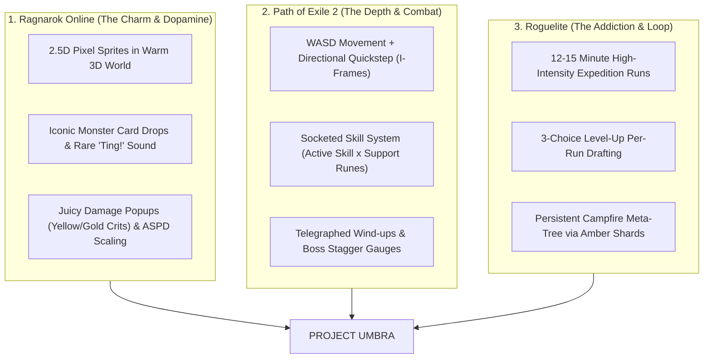
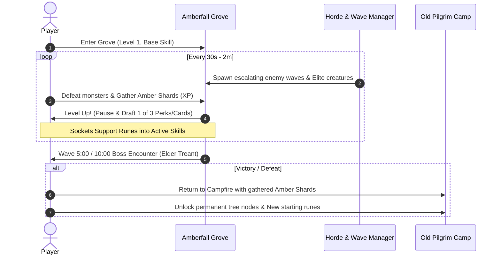
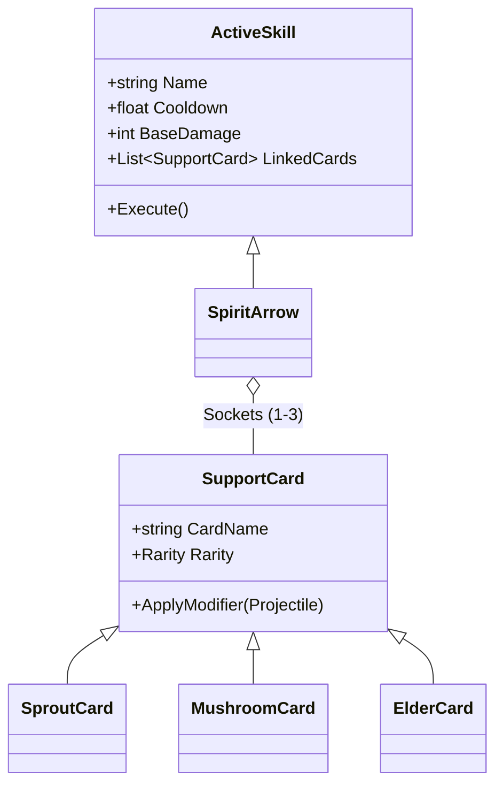

# GAME DESIGN DOCUMENT (GDD)
# Project Umbra: Amberfall Grove
*A 2.5D Action-RPG Roguelite Prototype*

---

## 1. Executive Summary

* **Project Codename**: Project Umbra (Amberfall Grove)
* **Genre**: 2.5D Action-RPG / Roguelite Horde Survival
* **Platform**: WebGL (Desktop Browser) & PC Standalone
* **Engine**: Unity 6 (6000.3.24f1) · Universal Render Pipeline (URP)
* **Target Audience**: Fans of *Ragnarok Online*, *Path of Exile 2*, *Hades*, and *Vampire Survivors*
* **Core Pitch**: *"The nostalgic sprite charm and card-hunting euphoria of Ragnarok Online, fused with the fluid WASD combat and deep skill-socketing of Path of Exile 2, inside an addictive, high-stakes Roguelite loop."*

---

## 2. Core Pillars & Creative Fusion

---

## 3. Game Loops

### 3.1. Moment-to-Moment Loop (Combat & Positioning)
* **Kite & Aim**: Move via WASD while aiming skills with mouse cursor.
* **Reactive Dodging**: Read enemy red telegraph indicators; time Spacebar Quickstep through attacks using invulnerability frames.
* **Synergy Triggering**: Line up Piercing Wind arrows through clustered enemies, bursting Ember Seed explosions on crowds.

### 3.2. Expedition Run Loop (10–15 Minutes)

---

## 4. Combat & Control Mechanics (PoE 2 Inspired)

| Input | Action | Mechanic Details |
|---|---|---|
| **WASD** | Free 8-Way Move | Character walks/runs relative to world; independent of mouse aim. |
| **Mouse Cursor** | Aim Direction | Player upper torso and projectile trajectories track crosshair. |
| **LMB (Hold)** | Active Skill 1 | Main primary attack (e.g., *Spirit Bow*). Modifiable via linked Runes. |
| **Q / RMB** | Active Skill 2 | Area/Defensive spell (e.g., *Wind Nova*). Knocks back nearby enemies. |
| **Space** | Quickstep / Roll | 0.28s duration, 0.18s invulnerability (I-Frames). Cancels attack recovery. 1.25s cooldown. |
| **E** | Mend Health | Tactical heal on 12s cooldown. Drops to 0s upon picking up Forest Shrines. |
| **Tab** | Rune/Card Socket Grid | Inspect active linked skill gem setups. |

### 4.1. Telegraph & Stagger System
* **Enemy Wind-up Indicator**: Red growing ground circles / arcs show incoming attacks (0.7s reaction window).
* **Stagger Meter**: Repeated hits to Elite/Boss enemies build a yellow Stagger Gauge below their HP. When full, the boss enters a 3-second groggy state, taking +50% critical damage.

---

## 5. The Monster Card & Socketing System (RO x PoE 2 Hybrid)

Instead of passive stat sheets, **Monster Cards drop from defeated foes and act like PoE 2 Support Gems**, slotting directly into your Active Skills during a run.

### 5.1. Active Skills (Skill Bases)
Each character has 2 Skill Sockets with 1 to 3 Link Slots:
1. **Spirit Arrow**: Fires high-velocity physical/elemental arrows.
2. **Wind Nova**: Radial shockwave pushing back all encroaching foes.

### 5.2. Monster Card Support Gems

| Card Name | Source Monster | Support Effect (When Linked to Skill) |
|---|---|---|
| **Sprout Card** | Sprout (Melee) | **Pierce + Ricochet**: Projectile pierces +1 target and branches towards nearest foe. |
| **Mushroom Card** | Mushroom (Poison) | **Toxic Cloud**: Enemies hit leave a poisonous fog dealing 30% DPS for 4s. |
| **Amber Golem Card** | Golem (Elite) | **Heavy Impact**: Adds +40% Stagger damage and knocks enemies back 2 units. |
| **Elder Treant Card** | Boss | **Ember Nova on Hit**: Triggers a secondary explosion whenever the skill crits. |

### 5.3. Card Drop Ceremony (Ragnarok Online Nostalgia)
* When a Card drops:
  1. High-frequency golden chime sound (**"Ting!"**).
  2. Vertical pillar of amber light visible across the map.
  3. Floating card item with rotating pixel sprite.

---

## 6. Roguelite Drafting & Meta-Progression

### 6.1. In-Run 3-Choice Level-Up Drafting
Upon collecting enough Amber XP, the game pauses with a stylized 3-card tarot selection:
* **Option A: New Support Card / Gem** (e.g., *Split Shot Card*).
* **Option B: Stat Augment** (e.g., *+20% ASPD, +10% Movement Speed*).
* **Option C: Skill Evolution** (If skill has 3 matching runes, evolves into a Mythic form, e.g., *Piercing Wind -> Storm of Thousand Gales*).

### 6.2. Persistent Meta-Progression: "The Tree of Remembrance"
Amber Shards collected during runs are deposited at the **Campfire Shrine**:

| Meta Talent | Effect per Level | Max Level | Shard Cost |
|---|---|---|---|
| **Pilgrim's Vigor** | +15 Base Max HP | Lv. 5 | 50 / 100 / 200 / 400 / 800 |
| **Nimble Footwork** | +5% Base Movement Speed & -5% Dash CD | Lv. 3 | 100 / 250 / 500 |
| **Rune Mastery** | Start each run with 1 random Common Card | Lv. 1 | 350 |
| **Alchemist's Luck** | +10% higher chance for Elite monsters to drop Cards | Lv. 3 | 150 / 300 / 600 |
| **Reroll Favor** | Gain 1 Reroll token per run for Level-Up drafts | Lv. 2 | 200 / 500 |

---

## 7. Art, Camera & Audio Direction

### 7.1. Visual Style: HD-2D / Modern Retro 2.5D
* **Perspective & Tilt-Shift**: Narrow Perspective Camera (FoV 34°) with **Bokeh Depth of Field** locked to the player, softly blurring distant tree canopies and foreground borders.
* **Lighting**: Late afternoon Golden Hour sun (`#FFA842`), casting long dramatic soft shadows, grounded by **Screen Space Ambient Occlusion (SSAO)** under vegetation and rocks.
* **Characters**: Crisp, unlit/ambient-aware 2D pixel sprites rendered in high-resolution 3D world space.

### 7.2. User Interface (UI/HUD)
* **Aesthetic**: Deep Slate-Green panels with gilded brass borders and engraved filigree.
* **Typography**: Medieval Serif headings (*Cinzel / Georgia*) with clean, legible numerals.
* **Combat Feedback**: Floating damage numbers with scale-pop animation (White for normal, Gold for Crits, Green for Heals).

### 7.3. Audio Design
* **Music**: Acoustic guitar, cello, and flute ambient folk music inside the grove.
* **SFX**: Sharp bow releases, crisp arrow impacts, low-frequency dash whoosh, and the dopamine-inducing **"Ting!"** drop sound.

---

## 8. Implementation Roadmap (Phases)

| Phase | Milestone | Key Deliverables |
|---|---|---|
| **Phase 1** | **The Horde & Auto-Targeting Slice** | • Continuous wave spawner scaling over 10 minutes. • Auto-aim closest enemy toggle. • 3-choice level-up perk modal UI. |
| **Phase 2** | **Socket & Card System** | • Monster Card drops with beam VFX & sound. • Sockets UI for linking 1-2 Cards to Spirit Arrow. • New Status Effects (Poison, Stun, Ignite). |
| **Phase 3** | **Elite & Boss Encounters** | • Wind-up telegraphs and Stagger gauge. • Boss fight: *The Elder Treant* with add summons and ground slams. |
| **Phase 4** | **Campfire Meta-Shop & Persistence** | • Campfire hub screen before entering Grove. • Skill Tree unlocking with persistent Amber Shards. |
